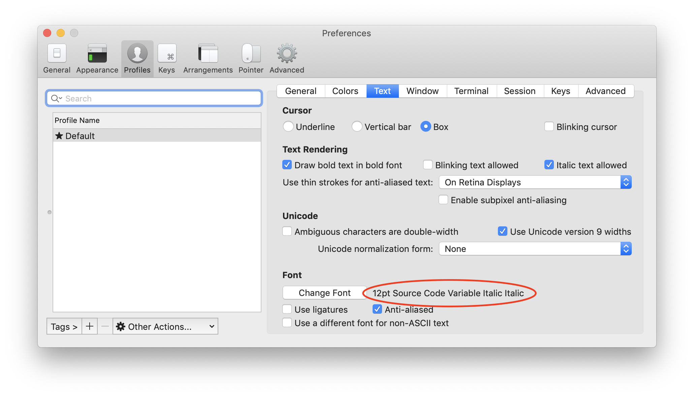
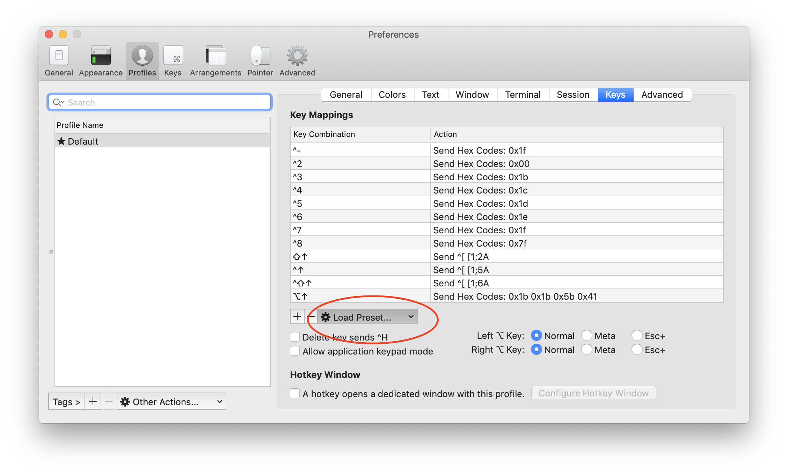
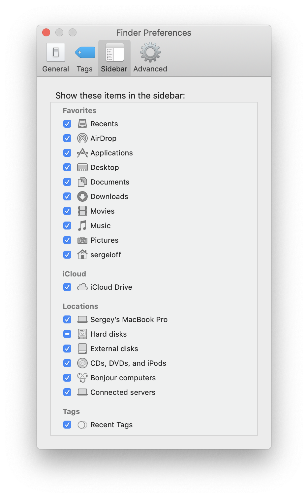

When I used Ubuntu as my main system I experimented a lot and often reinstalled the system. I’ve got to the conclusion that it might be handy to have a list of steps to do after a fresh system install.

Initially, I took a textbook and wrote down applications that I’ll need to install on a fresh system. With time I’ve decided to create a guide and put it to my GitHub. It stills [there](https://github.com/sergeioff/ubuntu-post-install). After all, I’ve realized that it’s possible to create a few scripts that will install everything for me.

Currently, I’m using OS X so I’ve decided to do the same script and guide for OS X.

## TLDR
- My post-install script:
```shell
echo "Enter your name:"
read NAME
echo "Enter your email:"
read EMAIL

# Install xcode console developer tools
xcode-select --install

# Git configuration
git config --global user.name $NAME
git config --global user.email $EMAIL
git config --global credential.helper osxkeychain

# Homebrew installation
/usr/bin/ruby -e "$(curl -fsSL https://raw.githubusercontent.com/Homebrew/install/master/install)"

# Check if Homebrew installed correctly
brew doctor

# Disable Homebrew analytics
brew analytics off

brew install zsh autojump httpie tree gradle p7zip pstree nvm

# Quick look plugins
brew cask install qlcolorcode qlstephen qlmarkdown quicklook-json quicklook-csv suspicious-package

# Development software
brew cask install java intellij-idea-ce visual-studio-code postman docker pycharm-ce dash sourcetree

# Software
brew cask install appcleaner google-chrome transmission vlc calibre spotify slack balenaetcher

# Install zsh-syntax-higlighting plugin
git clone https://github.com/zsh-users/zsh-syntax-highlighting.git ${ZSH_CUSTOM:-~/.oh-my-zsh/custom}/plugins/zsh-syntax-highlighting

# install oh my zsh
sh -c "$(curl -fsSL https://raw.githubusercontent.com/robbyrussell/oh-my-zsh/master/tools/install.sh)"
```
- My .zshrc config:
```shell
# Path to your oh-my-zsh installation.
export ZSH="/Users/sergeioff/.oh-my-zsh"

ZSH_THEME="agnoster"

COMPLETION_WAITING_DOTS="true"

plugins=(
  git
  autojump
  docker
  gradle
  httpie
  mvn
#  ng
  npm
#  vagrant
  vscode
  yarn
  colored-man
  zsh-syntax-highlighting
)

source $ZSH/oh-my-zsh.sh
```

- install [Node.js](https://nodejs.org/en/) through `nvm`
	- install Yarn package manager:
    ```
    sudo npm i -g yarn
    ```

- install fixed font for terminal from
https://github.com/adobe-fonts/source-code-pro/releases/tag/variable-fonts

### iTerm2 profile setup
- Select Solarized dark color scheme:
<div className="Image__Small">
    
</div>

- Select Source Code Variable Italic font:
<div className="Image__Small">
    
</div>

- Load natural text editing preset:
<div className="Image__Small">
    
</div>

### Adjust system settings:
- Show battery percentage
- Use stacks on Desktop
- Disable Bluetooth
- Link Google account (for calendar)
- Disable "Show recent applications in Dock"
- Show everything in Finder sidebar
<div className="Image__Small">
    
</div>

This way simplifies a new environment setup and saves a lot of time since almost everything is automatized.